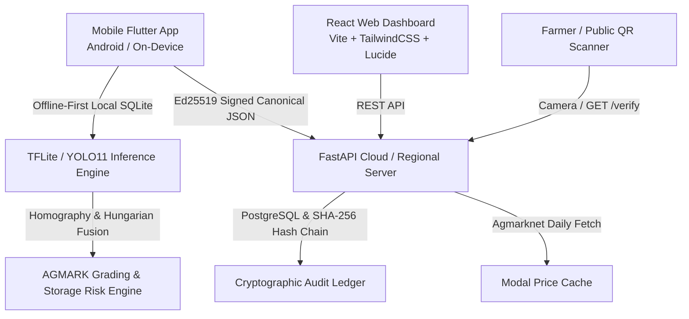

# AI Agent & Developer Project Guide: Agri-Grade AI (Mandi 2.0)

> **Repository**: `onionSIH`  
> **Target Problem**: Autonomous AI Quality Intelligence & Anti-Fraud Onion Grading for APMC Mandis and Buffer Stock Storage (Department of Consumer Affairs, Govt. of India).  
> **Current Version**: 2.1.0-SIH-Certified

---

## 1. High-Level System Architecture



---

## 2. Core Repository Layout

```
onionSIH/
├── backend/                  # FastAPI 0.115+ Backend & Cryptographic Ledger
│   ├── app/
│   │   ├── main.py           # FastAPI entry point & CORS middleware
│   │   ├── database.py       # SQLAlchemy engine & SQLite/Postgres session
│   │   ├── models.py         # DB Schemas: Report, Device, Override, Dispute, AuditLog
│   │   ├── routers/
│   │   │   ├── auth.py       # Inspector JWT Auth & Key Registry
│   │   │   ├── reports.py    # Report generation, analytics & image analysis
│   │   │   ├── verify.py     # Public QR verification & Demo Tamper Tool
│   │   │   ├── sync.py       # Offline sync queue & duplicate photo check
│   │   │   ├── stats.py      # Aggregated Mandi KPIs & bias stats
│   │   │   ├── disputes.py   # Farmer dispute resolution flow
│   │   │   ├── rules.py      # AGMARK 2026.1 rules configuration
│   │   │   ├── prices.py     # Daily Agmarknet market price fetcher
│   │   │   └── audit.py      # Hash-chained immutable audit log
│   │   └── services/         # Crypto, Price, Grading & Storage Risk logic
│   └── tests/                # Pytest integration & security test suite
│
├── config/                   # Centralized System Configurations
│   ├── grading_rules.json    # AGMARK Grade A, URS, Reject thresholds
│   ├── confidence_thresholds.json # Selective prediction thresholds
│   ├── storage_risk.json     # DoCA buffer stock storage risk weights
│   └── price_mapping.json    # Mandi modal price multipliers
│
├── dashboard/                # React 18 + Vite + TypeScript + TailwindCSS
│   ├── src/
│   │   ├── components/       # Header, Sidebar, OnionLogo
│   │   ├── pages/            # Overview, Reports, Consistency, Disputes, Rules,
│   │   │                     # AuditLog, Settings, LandingPage, PublicVerifyPage
│   │   ├── i18n.tsx          # Full English, Hindi (हिंदी), Marathi (मराठी) i18n
│   │   ├── api.ts            # Axios backend API client
│   │   └── types.ts          # TypeScript interfaces
│
├── ml/                       # Machine Learning, Computer Vision & Evaluation
│   ├── pipeline/
│   │   ├── segment.py        # YOLO model wrapper (best.pt auto-discovery)
│   │   └── run.py            # End-to-end inference & view fusion runner
│   ├── weights/              # best.pt PyTorch & TFLite weights
│   └── golden_tests/         # Parity test suite
│
├── mobile/                   # Flutter 3.x Mobile App (Inspector & Farmer)
│   ├── lib/
│   │   ├── screens/          # Language, Onboarding, InspectorHome, NewLot,
│   │   │                     # GuidedCapture, Processing, Results, Review,
│   │   │                     # ReportPreview, FarmerVerifyQR, FarmerDispute
│   │   ├── widgets/          # AppTheme, OnionLogo, InspectionStepper
│   │   ├── services/         # TtsService (multilingual voice), ApiService
│   │   └── l10n/             # Flutter ARB localization files
│
├── docs/                     # Evaluation benchmarks, Architecture & API docs
├── best.pt                   # Trained YOLO11n 5-class model weights
├── frontendchanges.md        # UI/UX and visual specifications
└── todo.md                   # USP Feature Pack: Trust-First Grading brief
```

---

## 3. Technology Stack

- **Backend**: Python 3.10+, FastAPI, SQLAlchemy, Pydantic v2, PyCryptodome / Cryptography (Ed25519 & SHA-256), Pytest.
- **ML / CV**: Ultralytics YOLO11n (5 classes: `healthy`, `mechanical_damage`, `rotten`, `sprouting`, `mould`), OpenCV (ArUco Marker 6x6_250 Homography, 1.42 mm MAE), SciPy (Hungarian View Association).
- **Web Dashboard**: React 18, TypeScript, Vite, TailwindCSS, Lucide Icons, Recharts, `localStorage` language persistence.
- **Mobile**: Flutter 3.x, Google Fonts (Inter), `flutter_tts` (Voice readout for Hindi/Marathi/English), `qr_flutter`, `mobile_scanner`.

---

## 4. Key Rules for Agents & Developers

1. **Aesthetics & Tone**:
   - Light Government-Tech Aesthetic (`#15803d` primary green, `#831843` onion purple, `#f8fafc` off-white).
   - Strict status colors: Green (`Grade A`), Amber (`URS / Under-sized`), Red (`Rejected / Defective`), Grey (`Needs Manual Review`).
2. **Honesty & Cryptography**:
   - **NO blockchain claims**: Always describe the security ledger as *"Ed25519 asymmetric digital signatures, canonical SHA-256 hashes, and a hash-chained audit ledger"*.
   - Storage risk, lot valuation, and weight percentages must always be labelled *indicative / estimated*.
3. **Multilingual Requirement**:
   - Any new text, button, or label added to the dashboard or mobile app **must** support English, Hindi (हिंदी), and Marathi (मराठी).
4. **Selective Prediction & Overrides**:
   - Unsure bulbs ($conf < threshold$ or class confidence delta $\le 0.10$) must be routed to `NEEDS_MANUAL_CHECK`.
   - Every supervisor or inspector override must be recorded in the immutable audit log with before/after classes and justification.
