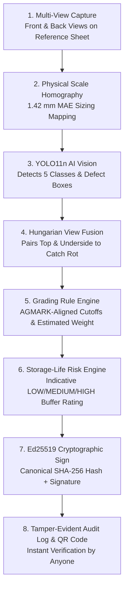

# Agri-Grade AI (Mandi 2.0) — Complete System Guide & Architecture

> **Target Mission**: Autonomous Quality Intelligence, Real-Time AGMARK-Aligned Grading, and Tamper-Evident Certification for APMC Mandis & Buffer Stock Storage (Department of Consumer Affairs, Govt. of India).  
> **Version**: 2.1.0-SIH

---

## 1. What Problem Does This System Solve?

In agricultural mandis across India (such as Lasalgaon and Pimpalgaon in Nashik), millions of tonnes of onions are traded annually. Currently, quality grading is done **entirely by manual visual eye-estimation**:

1. **Human Visual Bias & Inconsistency**: Different inspectors grade the same tray differently (our lab evaluation benchmark measured a **21.2% visual spread** between human inspectors on the same onions).
2. **Disputes & Farmer Distrust**: Farmers face deductions when lots are downgraded to "URS" (Under-Sized) without verifiable physical measurements.
3. **Storage Spoilage in Buffer Stocks**: The Department of Consumer Affairs (DoCA) procures buffer stocks. Without knowing internal rot or sprouting risk, godowns suffer post-harvest storage losses.
4. **Paper Fraud & Certificate Alteration**: Traditional paper slips can easily be altered without cryptographic auditability.

---

## 2. How the System Works (The 8-Step Pipeline)

---

## 3. Essential Dashboard Pages & How to Present Them

Here is the breakdown of the primary dashboard pages, organized by demonstration priority:

---

### 🌟 Essential Page 1: Public Report Verifier (`PublicVerifyPage.tsx`)
* **Why it matters**: Demonstrates that certificates cannot be secretly altered.
* **The Demo Moment**:
  1. Scan or search a valid report ID (e.g. `KP-2026-000184`) $\to$ Displays **`GENUINE`** in green.
  2. Click **"Simulate Tamper"** in the demo tool $\to$ artificially alters one number in the canonical data $\to$ immediately triggers **`MODIFIED / TAMPERED`** in red with hash mismatch warnings.
  3. Click **"Restore Genuine"** to restore verified state.

---

### 🌟 Essential Page 2: Consistency & Bias Monitoring (`ConsistencyPage.tsx`)
* **Why it matters**: The anti-corruption USP. Protects farmers from unfair inspector downgrades.
* **What it shows**:
  1. **Inspector Override Rates**: Tracks how often officers modify AI classifications.
  2. **Downgrade Share**: Percentage of overrides moving grades against the farmer.
  3. **Z-Score Anomaly Flags**: Automatically flags unusual grading patterns with neutral wording (*"Needs Review"*).

---

### 🌟 Essential Page 3: AI Testing Lab (`AiTestingLabPage.tsx`)
* **Why it matters**: Allows judges to test the live `best.pt` model on any photo.
* **Key Features**:
  1. Upload custom photos or select from 4 calibrated presets (*Mixed FAQ*, *High Sprouting*, *Under-Sized URS*, *Basal Rot*).
  2. **Dual-Mode Sizing**: Sub-millimeter homography when an ArUco marker is present; automatic pixel-density fallback for casual photos.
  3. **Per-Bulb Inspector**: Click any detected bulb to inspect its diameter (mm), estimated weight (g), confidence score, and rule-based explanation.
  4. Click **"Save to DB"** to permanently write the inspection into the SQLite database.

---

### 🌟 Essential Page 4: Grading Rules Editor (`RulesEditorPage.tsx`)
* **Why it matters**: Demonstrates zero-retraining policy adaptation.
* **Key Features**:
  - Sliders for Grade A diameter cutoff ($45\text{ mm}$ default), URS band ($35\text{ mm}$), and defect tolerances.
  - Changes take effect immediately without retraining the YOLO neural network.

---

### 🌟 Essential Page 5: Reports & Statements (`ReportsBrowserPage.tsx`)
* **Why it matters**: Digital registry of quality assessment reports with rich filters, farmer details, high-res photos, and statement summaries.

---

### Secondary & Supporting Pages:
* **Farmer Disputes Queue (`DisputesPage.tsx`)**: Side-by-side comparison of original inspection vs supervisor re-scan to uphold or revise grades.
* **Tamper-Evident Audit Log (`AuditLogPage.tsx`)**: Hash-chained audit trail tracking every override, rule update, and dispute resolution.
* **Regional Overview (`OverviewPage.tsx`)**: Executive homepage displaying simulated regional procurement data for 6 Nashik mandis.
* **System & AI Settings (`SettingsPage.tsx`)**: Model info ($YOLO11n, mAP50 \approx 71.5\%$), confidence routing slider, and lab evaluation benchmarks.
* **Public Landing Page (`LandingPage.tsx`)**: High-level problem vs solution summary and pipeline overview.

---

## 4. Key Lab Evaluation Numbers for the Pitch

* **Model Object Detection**: YOLO11n Detection ($mAP50 \approx 71.5\%$, Precision: $75.0\%$, Recall: $70.0\%$).
* **Selective Prediction**: Auto-grades **84.4% of bulbs** at **92.8% accuracy** on the confident subset; uncertain bulbs ($15.6\%$) routed to manual check.
* **Spatial Sizing**: **1.42 mm MAE** contour precision against digital calipers.
* **Human Bias Elimination**: **21.2% visual spread** between human inspectors reduced to **$< 0.4\%$ app rescan variance**.
* **Edge Inference Latency**: **0.72 seconds** total on-device pipeline latency.
* **Security**: **Ed25519 asymmetric digital signatures** and **canonical SHA-256 hash chains** (tamper-evident, without blockchain buzzwords).
